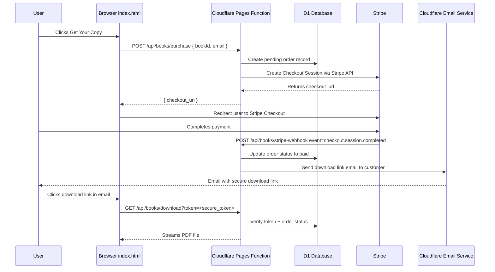
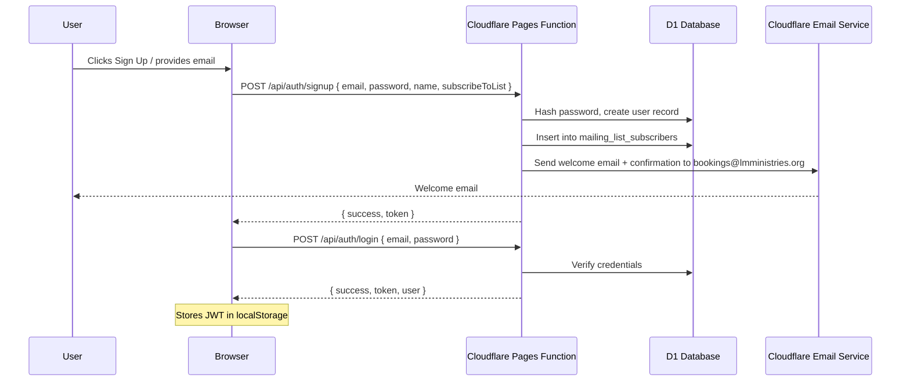

# Book Purchase Flow + Auth + Mailing List — Architecture Plan

## Overview

This plan covers three interconnected features for [`LM Ministries`](index.html):

1. **Book Purchase Flow** — User clicks "Get Your Copy" → Stripe Payment Link → Success Page → Downloadable PDF
2. **Sign-up / Login** — User accounts with email/password, linked to the mailing list
3. **Mailing List** — Subscriber management connected to `bookings@lmministries.org` via Cloudflare Email Service

---

## 1. Current State Analysis

### What exists today

| Component | Status | Details |
|-----------|--------|---------|
| [`index.html`](index.html) | ✅ Live | Single-page site with books section, booking calendar, sermons, social hub |
| [`purchaseBook()`](index.html:988) | ⚠️ Stub | Currently just shows a toast notification — no real purchase flow |
| [`functions/api/book-speaking.ts`](functions/api/book-speaking.ts) | ✅ Live | POST handler for speaking invitations, sends email via Cloudflare REST API |
| [`functions/_middleware.ts`](functions/_middleware.ts) | ✅ Live | CORS + admin auth middleware |
| [`functions/api/admin/`](functions/api/admin/) | ✅ Live | Full admin CRUD for bookings + date blocking |
| [`migrations/0001_create_tables.sql`](migrations/0001_create_tables.sql) | ✅ Live | `speaking_invitations` + `blocked_dates` tables |
| [`wrangler.jsonc`](wrangler.jsonc) | ✅ Live | D1 binding configured, no `send_email` binding yet |
| Email sending | ⚠️ Partial | Uses REST API with `ADMIN_SECRET` — should migrate to Workers binding |

### What's missing

- **Book purchase**: No Stripe integration, no payment link generation, no download delivery
- **User auth**: No sign-up, login, or session management
- **Mailing list**: No subscriber database, no opt-in mechanism, no email campaign capability
- **Email binding**: `wrangler.jsonc` lacks `send_email` binding (currently using REST API)

---

## 2. Architecture & Data Flow

### 2.1 Book Purchase Flow



### 2.2 Sign-up / Login + Mailing List



### 2.3 System Architecture

```mermaid
graph TB
    subgraph "Frontend - index.html"
        A[Books Section] -->|Get Your Copy| B[Purchase Modal]
        C[Sign Up / Login Modal] -->|Auth| D[User Session]
        E[Mailing List Opt-in] -->|Subscribe| F[API Call]
    end

    subgraph "Cloudflare Pages Functions"
        G[/api/books/purchase]
        H[/api/books/stripe-webhook]
        I[/api/books/download]
        J[/api/auth/signup]
        K[/api/auth/login]
        L[/api/mailing/subscribe]
        M[/api/mailing/unsubscribe]
    end

    subgraph "Cloudflare D1"
        N[(orders table)]
        O[(users table)]
        P[(mailing_list_subscribers)]
    end

    subgraph "External"
        Q[Stripe API]
        R[Cloudflare Email Service]
        S[R2 - Book PDF Storage]
    end

    G --> N
    G --> Q
    H --> N
    H --> R
    I --> N
    I --> S
    J --> O
    J --> P
    J --> R
    K --> O
    L --> P
    M --> P
```

---

## 3. Database Schema — New Tables

### Migration `migrations/0002_create_books_auth_tables.sql`

```sql
-- Books / Orders
CREATE TABLE IF NOT EXISTS books (
    id INTEGER PRIMARY KEY AUTOINCREMENT,
    title TEXT NOT NULL,
    slug TEXT NOT NULL UNIQUE,
    description TEXT DEFAULT '',
    price_cents INTEGER NOT NULL,
    stripe_price_id TEXT NOT NULL,
    pdf_path TEXT NOT NULL,          -- R2 object key
    cover_image TEXT DEFAULT '',
    is_active INTEGER DEFAULT 1,
    created_at TEXT DEFAULT (datetime('now'))
);

CREATE TABLE IF NOT EXISTS orders (
    id INTEGER PRIMARY KEY AUTOINCREMENT,
    user_id INTEGER,
    book_id INTEGER NOT NULL,
    email TEXT NOT NULL,
    stripe_session_id TEXT UNIQUE,
    stripe_payment_intent TEXT,
    amount_cents INTEGER NOT NULL,
    currency TEXT DEFAULT 'usd',
    status TEXT NOT NULL DEFAULT 'pending',  -- pending, paid, fulfilled, refunded
    download_token TEXT UNIQUE,
    download_count INTEGER DEFAULT 0,
    created_at TEXT DEFAULT (datetime('now')),
    fulfilled_at TEXT,
    FOREIGN KEY (book_id) REFERENCES books(id)
);

-- Users / Auth
CREATE TABLE IF NOT EXISTS users (
    id INTEGER PRIMARY KEY AUTOINCREMENT,
    email TEXT NOT NULL UNIQUE,
    password_hash TEXT NOT NULL,
    name TEXT DEFAULT '',
    is_subscribed INTEGER DEFAULT 0,  -- mailing list opt-in
    created_at TEXT DEFAULT (datetime('now')),
    last_login_at TEXT
);

-- Mailing List
CREATE TABLE IF NOT EXISTS mailing_list_subscribers (
    id INTEGER PRIMARY KEY AUTOINCREMENT,
    email TEXT NOT NULL UNIQUE,
    name TEXT DEFAULT '',
    user_id INTEGER,
    source TEXT DEFAULT 'signup',  -- signup, purchase, manual
    is_active INTEGER DEFAULT 1,
    subscribed_at TEXT DEFAULT (datetime('now')),
    unsubscribed_at TEXT,
    FOREIGN KEY (user_id) REFERENCES users(id)
);
```

---

## 4. New Cloudflare Pages Functions

### 4.1 Book Purchase Functions

| Endpoint | Method | Purpose |
|----------|--------|---------|
| [`functions/api/books/purchase.ts`](functions/api/books/purchase.ts) | POST | Create Stripe Checkout Session, store pending order |
| [`functions/api/books/stripe-webhook.ts`](functions/api/books/stripe-webhook.ts) | POST | Stripe webhook — fulfill order on payment success |
| [`functions/api/books/download.ts`](functions/api/books/download.ts) | GET | Verify download token, stream PDF from R2 |

### 4.2 Auth Functions

| Endpoint | Method | Purpose |
|----------|--------|---------|
| [`functions/api/auth/signup.ts`](functions/api/auth/signup.ts) | POST | Create user, hash password, optionally subscribe to mailing list |
| [`functions/api/auth/login.ts`](functions/api/auth/login.ts) | POST | Verify credentials, return JWT |
| [`functions/api/auth/me.ts`](functions/api/auth/me.ts) | GET | Return current user info from JWT |

### 4.3 Mailing List Functions

| Endpoint | Method | Purpose |
|----------|--------|---------|
| [`functions/api/mailing/subscribe.ts`](functions/api/mailing/subscribe.ts) | POST | Add email to mailing list, send confirmation |
| [`functions/api/mailing/unsubscribe.ts`](functions/api/mailing/unsubscribe.ts) | POST | Remove/opt-out subscriber |
| [`functions/api/mailing/send.ts`](functions/api/mailing/send.ts) | POST | Admin-only: send broadcast to subscribers |

---

## 5. Frontend Changes to [`index.html`](index.html)

### 5.1 Purchase Modal

Replace the current [`purchaseBook()`](index.html:988) stub with a modal flow:

1. User clicks "Get Your Copy" on a book
2. Modal appears with:
   - Book cover + title + price
   - Email input (pre-filled if logged in)
   - "Subscribe to mailing list" checkbox
   - "Proceed to Checkout" button
3. On submit → `POST /api/books/purchase` → redirect to Stripe Checkout URL

### 5.2 Auth Modal

Add sign-up/login modal accessible from header:

- **Sign Up**: Name, Email, Password, Confirm Password, Subscribe checkbox
- **Login**: Email, Password
- Store JWT in `localStorage`, attach `Authorization: Bearer <token>` header to API calls
- Show user name + logout button when authenticated

### 5.3 Mailing List Opt-in

Add a dedicated mailing list section (e.g., before footer) with:

- Email input + "Subscribe" button
- Links to the auth modal for full account creation
- Unsubscribe link in footer

---

## 6. Configuration Changes

### [`wrangler.jsonc`](wrangler.jsonc) — Add bindings

```jsonc
{
  "name": "lm-live-site",
  "pages_build_output_dir": ".",
  "d1_databases": [
    {
      "binding": "DB",
      "database_name": "lm-ministries-db",
      "database_id": "8ceeae12-549e-4c4a-81a5-48c30bc170e9"
    }
  ],
  "send_email": [
    { "name": "EMAIL" }
  ],
  "r2_buckets": [
    {
      "binding": "BOOKS_BUCKET",
      "bucket_name": "lm-books-pdfs",
      "jurisdiction": "auto"
    }
  ]
}
```

### Environment Variables / Secrets

| Secret | Purpose |
|--------|---------|
| `STRIPE_SECRET_KEY` | Stripe API secret key |
| `STRIPE_WEBHOOK_SECRET` | Stripe webhook signing secret |
| `JWT_SECRET` | Secret for signing auth tokens |
| `ADMIN_SECRET` | Existing — for admin panel auth |

---

## 7. Email Notifications

All emails sent via Cloudflare Email Service Workers binding (migrate from REST API):

| Trigger | Email | To |
|---------|-------|-----|
| New mailing list subscriber | Welcome + confirmation | Subscriber |
| Book purchase successful | Download link with secure token | Customer |
| New speaking booking | Notification (already exists) | `bookings@lmministries.org` |
| Admin broadcast | Newsletter / update | All active subscribers |

**Important**: Cloudflare Email Service is for **transactional** emails only. For newsletters/broadcasts, use a dedicated marketing platform (e.g., Mailchimp, SendGrid) or keep broadcasts low-volume and manual.

---

## 8. Secure Download Flow

1. On successful Stripe payment, generate a unique `download_token` (UUID v4)
2. Store token in `orders.download_token` + set `status = 'fulfilled'`
3. Email the download link: `https://lmministries.org/api/books/download?token=<uuid>`
4. On GET request:
   - Look up token in D1
   - Verify order status is `fulfilled`
   - Increment `download_count`
   - Stream PDF from R2 bucket
5. Token expires after 7 days or 5 downloads (configurable)

---

## 9. Implementation Order

| Step | Task | Dependencies |
|------|------|-------------|
| 1 | Add `send_email` binding to [`wrangler.jsonc`](wrangler.jsonc) | None |
| 2 | Create migration `0002` for new tables | Step 1 |
| 3 | Create R2 bucket `lm-books-pdfs` via wrangler | None |
| 4 | Implement [`functions/api/books/purchase.ts`](functions/api/books/purchase.ts) | Step 2 |
| 5 | Implement [`functions/api/books/stripe-webhook.ts`](functions/api/books/stripe-webhook.ts) | Step 2, 4 |
| 6 | Implement [`functions/api/books/download.ts`](functions/api/books/download.ts) | Step 2, 3 |
| 7 | Implement [`functions/api/auth/signup.ts`](functions/api/auth/signup.ts) | Step 2 |
| 8 | Implement [`functions/api/auth/login.ts`](functions/api/auth/login.ts) | Step 2, 7 |
| 9 | Implement [`functions/api/auth/me.ts`](functions/api/auth/me.ts) | Step 8 |
| 10 | Implement [`functions/api/mailing/subscribe.ts`](functions/api/mailing/subscribe.ts) | Step 2 |
| 11 | Implement [`functions/api/mailing/unsubscribe.ts`](functions/api/mailing/unsubscribe.ts) | Step 2 |
| 12 | Build purchase modal + auth modal in [`index.html`](index.html) | Steps 4-9 |
| 13 | Add mailing list section to [`index.html`](index.html) | Step 10 |
| 14 | Migrate existing email sending in [`book-speaking.ts`](functions/api/book-speaking.ts) from REST API to Workers binding | Step 1 |
| 15 | Seed `books` table with current two books | Step 2 |
| 16 | Upload PDF files to R2 bucket | Step 3 |
| 17 | End-to-end testing | All above |

---

## 10. Key Design Decisions

1. **JWT for auth** — Stateless, no session store needed. Token stored in `localStorage`, sent as `Authorization: Bearer` header.
2. **Password hashing** — Use Web Crypto API (`crypto.subtle`) with PBKDF2 + SHA-256 in the Pages Function (no external deps needed).
3. **Stripe Checkout** — Redirect-based flow (not Elements) for simplicity. No PCI scope.
4. **Download tokens** — Single-use-ish (configurable limit), time-limited, stored in D1. No need for signed R2 URLs.
5. **Mailing list in D1** — Simple for now. Can export to Mailchimp later if list grows.
6. **Email binding over REST API** — Simpler code, no API keys to manage in the Worker, better error handling with typed errors.
