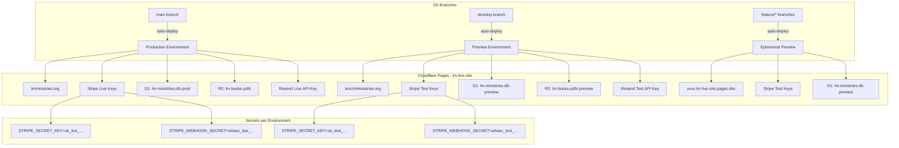
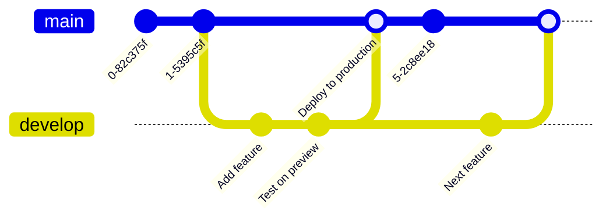

# Dev / Test / Production Workflow — LM Ministries Cloudflare Pages

## 1. Recommended Approach: **Option A — Branch Deployments + Preview Aliases**

**Why Option A wins for this project:**

| Factor | Option A (Branch Deployments) | Option B (Separate Project) | Option C (Local Dev Only) |
|--------|------------------------------|-----------------------------|---------------------------|
| **Isolation** | ✅ Good — separate env vars per branch | ✅ Best — fully isolated | ❌ No deployment isolation |
| **Management overhead** | ✅ Low — single project | ❌ High — two projects to maintain | ✅ Low |
| **Stripe webhook testing** | ✅ Preview URL is publicly reachable | ✅ Same | ❌ Requires ngrok/Stripe CLI |
| **Git integration** | ✅ Native — branches map to deployments | ⚠️ Manual — need separate deploy config | ❌ None |
| **Cost** | ✅ Free (included in Pages) | ❌ Extra build minutes, two D1 instances | ✅ Free |
| **D1 database isolation** | ✅ Separate DB per branch | ✅ Separate DB per project | ⚠️ Local only |
| **Custom domain** | ✅ `test.lmministries.org` via DNS alias | ✅ Same | ❌ N/A |

**Verdict**: Option A gives you production-grade preview deployments with zero extra cost, native Git integration, and the ability to test Stripe webhooks end-to-end because the preview URL is publicly accessible on the internet.

---

## 2. Architecture Overview



### Key Concepts

1. **`main` branch** → Production (`lmministries.org`) — uses live Stripe keys, production D1
2. **`develop` branch** → Preview (`test.lmministries.org`) — uses test Stripe keys, preview D1
3. **Feature branches** → Ephemeral preview URLs (`<hash>.lm-live-site.pages.dev`) — also use test keys
4. **Local development** → `npx wrangler pages dev` with `.dev.vars` — test keys, local D1 or mock

---

## 3. Step-by-Step Setup Instructions

### 3.1 Create the Preview D1 Database

```bash
# Create a separate D1 database for preview/testing
npx wrangler d1 create lm-ministries-db-preview
```

This outputs a `database_id`. Save it — you'll need it for the next step.

### 3.2 Update `wrangler.jsonc` for Branch-Specific Bindings

Cloudflare Pages supports **environment-specific overrides** in `wrangler.jsonc`. Here's the updated config:

```jsonc
{
  "name": "lm-live-site",
  "pages_build_output_dir": ".",
  "d1_databases": [
    {
      "binding": "DB",
      "database_name": "lm-ministries-db",
      "database_id": "8ceeae12-549e-4c4a-81a5-48c30bc170e9"
    }
  ],
  "r2_buckets": [
    {
      "binding": "BOOKS_BUCKET",
      "bucket_name": "lm-books-pdfs"
    }
  ],
  "env": {
    "preview": {
      "d1_databases": [
        {
          "binding": "DB",
          "database_name": "lm-ministries-db-preview",
          "database_id": "<PREVIEW_DATABASE_ID>"
        }
      ],
      "r2_buckets": [
        {
          "binding": "BOOKS_BUCKET",
          "bucket_name": "lm-books-pdfs-preview"
        }
      ]
    }
  }
}
```

> **Note**: The `env.preview` block applies to **all non-production branch deployments** (both `develop` and feature branches). Production (`main` branch) uses the top-level bindings.

### 3.3 Set Up Environment-Specific Secrets

Secrets are set per-environment using the `--env` flag:

```bash
# --- Production secrets (main branch) ---
npx wrangler pages secret put STRIPE_SECRET_KEY --env production
# Paste: sk_live_...

npx wrangler pages secret put STRIPE_WEBHOOK_SECRET --env production
# Paste: whsec_live_...

npx wrangler pages secret put JWT_SECRET --env production
# Paste: <production-jwt-secret>

npx wrangler pages secret put ADMIN_SECRET --env production
# Paste: <production-admin-secret>

npx wrangler pages secret put RESEND_API_KEY --env production
# Paste: re_... (live Resend key)

# --- Preview secrets (develop + feature branches) ---
npx wrangler pages secret put STRIPE_SECRET_KEY --env preview
# Paste: sk_test_...

npx wrangler pages secret put STRIPE_WEBHOOK_SECRET --env preview
# Paste: whsec_test_...

npx wrangler pages secret put JWT_SECRET --env preview
# Paste: <preview-jwt-secret> (can be different from production)

npx wrangler pages secret put ADMIN_SECRET --env preview
# Paste: <preview-admin-secret> (can be different)

npx wrangler pages secret put RESEND_API_KEY --env preview
# Paste: re_... (test Resend key, or same if you want real emails in preview)
```

### 3.4 Set Up the Preview Custom Domain (Optional)

If you want `test.lmministries.org` instead of a random `pages.dev` URL:

1. Go to **Cloudflare Dashboard → Pages → lm-live-site → Custom domains**
2. Add `test.lmministries.org`
3. Create a DNS `CNAME` record: `test.lmministries.org` → `lm-live-site.pages.dev`
4. In **Pages → lm-live-site → Production branch**, set it to `main`
5. In **Pages → lm-live-site → Preview branches**, ensure `develop` is listed
6. The `test.lmministries.org` domain will automatically point to the latest `develop` branch deployment

### 3.5 Apply Migrations to the Preview D1 Database

```bash
# Apply all migrations to the preview database
npx wrangler d1 migrations apply lm-ministries-db-preview --remote

# Seed the books table (if needed)
# You can run a one-off script or use the D1 console
```

### 3.6 Create a Preview R2 Bucket (Optional)

If you want to test with separate PDF files:

```bash
npx wrangler r2 bucket create lm-books-pdfs-preview
```

Then upload test PDFs to this bucket. If you don't need separate files, you can share the production R2 bucket — just be aware that preview purchases would download production PDFs.

---

## 4. Git Workflow



### Daily Workflow

```bash
# 1. Start a new feature
git checkout main
git pull
git checkout -b feature/my-feature

# 2. Make changes locally
# ... edit files ...

# 3. Test locally with wrangler
npx wrangler pages dev . --d1 DB=lm-ministries-db-preview

# 4. Commit and push — triggers preview deployment
git add .
git commit -m "feat: add my feature"
git push -u origin feature/my-feature
# → Cloudflare builds and deploys to: <hash>.lm-live-site.pages.dev

# 5. Test on the preview URL with Stripe test cards

# 6. Merge to develop for a named preview
git checkout develop
git merge feature/my-feature
git push
# → Cloudflare deploys to: test.lmministries.org (or develop.lm-live-site.pages.dev)

# 7. Final testing on test.lmministries.org

# 8. Merge to main for production
git checkout main
git merge develop
git push
# → Cloudflare deploys to: lmministries.org
```

### Cloudflare Pages Auto-Deployment Setup

In the **Cloudflare Dashboard → Pages → lm-live-site**:

| Setting | Value |
|---------|-------|
| **Production branch** | `main` |
| **Branch deployments** | Enable |
| **Preview branches** | `develop`, `feature/*`, `fix/*` |
| **Auto-deploy** | On (for all branches) |

---

## 5. Environment Variable Management

### 5.1 Summary of All Secrets

| Secret | Production (`main`) | Preview (`develop`/`feature/*`) | Local (`.dev.vars`) |
|--------|---------------------|---------------------------------|---------------------|
| `STRIPE_SECRET_KEY` | `sk_live_...` | `sk_test_...` | `sk_test_...` |
| `STRIPE_WEBHOOK_SECRET` | `whsec_live_...` | `whsec_test_...` | `whsec_test_...` |
| `JWT_SECRET` | Production JWT secret | Preview JWT secret | `local-dev-jwt-secret...` |
| `ADMIN_SECRET` | Production admin secret | Preview admin secret | `local-dev-admin-secret` |
| `RESEND_API_KEY` | Live Resend key | Test Resend key (or live) | `re_...` |

### 5.2 Local Development (`.dev.vars`)

The existing [`.dev.vars`](.dev.vars) file already contains test/local values. **Keep this file in `.gitignore`** (it already is). For local testing with Stripe test keys:

```bash
# Run the local dev server with D1 binding
npx wrangler pages dev . --d1 DB=lm-ministries-db-preview
```

This reads `.dev.vars` for secrets and proxies the preview D1 database.

### 5.3 Frontend Environment Variables

The frontend Vite env vars (`.env.development`, `.env.production`) are **build-time only** and don't contain secrets. They control the API base URL and mock data toggle:

- [`.env.development`](.env.development): `VITE_API_BASE_URL=http://localhost:3001` — for local dev with mock server
- [`.env.production`](.env.production): `VITE_API_BASE_URL=https://api.lmministries.org` — for production

For the preview deployment, you may want a third file:

```
# .env.preview
VITE_USE_MOCK_DATA=false
VITE_API_BASE_URL=https://test.lmministries.org
```

Then update `vite.config.js` to load it based on the branch, or simply let the frontend use relative URLs (which work automatically since Pages Functions are on the same domain).

> **Recommendation**: Use **relative URLs** in the frontend (e.g., `/api/books/purchase` instead of `https://api.lmministries.org/api/books/purchase`). This way, the same frontend code works on all environments without per-environment config.

---

## 6. D1 Database Strategy

### 6.1 Database Instances

| Environment | Database Name | Purpose |
|-------------|---------------|---------|
| Production | `lm-ministries-db` | Live data — real orders, real users |
| Preview | `lm-ministries-db-preview` | Test data — test orders, test users |

### 6.2 Keeping Databases in Sync

Since the preview DB starts empty, you need to:

1. **Apply all migrations** to the preview DB:
   ```bash
   npx wrangler d1 migrations apply lm-ministries-db-preview --remote
   ```

2. **Seed test data** — run a one-off script or use the D1 console to insert test books:
   ```sql
   INSERT INTO books (title, slug, description, price_cents, stripe_price_id, pdf_path, cover_image)
   VALUES
       ('Fear! No More.', 'fear-no-more', '...', 1499, '', 'books/fear-no-more.pdf', '...'),
       ('There''s Levels To This', 'theres-levels-to-this', '...', 1499, '', 'books/theres-levels-to-this.pdf', '...');
   ```

3. **Automate migration application** — add a `postdeploy` script or run migrations manually after each schema change.

### 6.3 Migration Workflow

When you add a new migration:

```bash
# 1. Create the migration
npx wrangler d1 migrations create lm-ministries-db <migration_name>

# 2. Edit the generated SQL file

# 3. Apply to preview first
npx wrangler d1 migrations apply lm-ministries-db-preview --remote

# 4. Test on preview

# 5. Apply to production
npx wrangler d1 migrations apply lm-ministries-db --remote
```

### 6.4 Data Isolation

- **Preview DB** gets test orders created with Stripe test mode. These are not real payments.
- **Production DB** gets real orders from real Stripe payments.
- **No cross-contamination**: the preview deployment's `DB` binding points to the preview database, so test purchases never touch production data.

---

## 7. Stripe Configuration for Preview

### 7.1 Stripe Test Mode Setup

1. **Enable test mode** in your Stripe Dashboard (toggle in the top-left)
2. **Create test Payment Links** for each book:
   - Go to **Stripe Dashboard → Payment Links → Create**
   - Use test mode
   - Set price to match your books (e.g., $14.99)
   - Copy the test Payment Link URL (starts with `https://buy.stripe.com/test_...`)
3. **Get test webhook secret**:
   - Go to **Stripe Dashboard → Developers → Webhooks**
   - Add endpoint: `https://test.lmministries.org/api/books/stripe-webhook`
   - Select event: `checkout.session.completed`
   - Reveal the signing secret (starts with `whsec_test_...`)

### 7.2 Update Payment Links Per Environment

The [`PAYMENT_LINKS`](functions/api/books/purchase.ts:32) map in `purchase.ts` currently hardcodes production Payment Link URLs. To support test mode, you have two options:

**Option A (Recommended): Environment-specific Payment Links via secrets**

Add a new secret `STRIPE_PAYMENT_LINKS` as a JSON string:

```typescript
// In purchase.ts
const paymentLinksRaw = env.STRIPE_PAYMENT_LINKS || '{}';
const PAYMENT_LINKS: Record<string, string> = JSON.parse(paymentLinksRaw);
```

Then set the secret per environment:

```bash
# Production
npx wrangler pages secret put STRIPE_PAYMENT_LINKS --env production
# Value: {"fear-no-more":"https://buy.stripe.com/8x2...","theres-levels-to-this":"https://buy.stripe.com/6oU..."}

# Preview
npx wrangler pages secret put STRIPE_PAYMENT_LINKS --env preview
# Value: {"fear-no-more":"https://buy.stripe.com/test_...","theres-levels-to-this":"https://buy.stripe.com/test_..."}
```

**Option B: Use environment variable in the code**

```typescript
const isTestMode = env.STRIPE_SECRET_KEY.startsWith('sk_test_');
const BASE = isTestMode
  ? { 'fear-no-more': 'https://buy.stripe.com/test_xxx', ... }
  : { 'fear-no-more': 'https://buy.stripe.com/8x2...', ... };
```

Option A is cleaner because it keeps the URLs as deploy-time configuration rather than code logic.

### 7.3 Testing the Full Purchase Flow on Preview

1. Go to `https://test.lmministries.org` (or the preview URL)
2. Click "Get Your Copy" on a book
3. Proceed through the purchase flow
4. On the Stripe Checkout page, use a **test card number**:
   - **Success**: `4242 4242 4242 4242` — any future expiry date, any CVC
   - **Declined**: `4000 0000 0000 0002` — simulates a decline
   - **Requires authentication**: `4000 0025 0000 3155` — tests 3D Secure flow
5. Complete the payment
6. Verify:
   - The webhook fires and creates the order in the **preview D1 database**
   - The download email is sent (or check the D1 database directly)
   - The download link works

### 7.4 Stripe Webhook Configuration

Since the preview URL is publicly accessible, Stripe can send webhooks to it:

| Environment | Webhook URL | Stripe Mode |
|-------------|-------------|-------------|
| Production | `https://lmministries.org/api/books/stripe-webhook` | Live |
| Preview | `https://test.lmministries.org/api/books/stripe-webhook` | Test |

Configure both endpoints in the **Stripe Dashboard → Developers → Webhooks**. Each will only receive events for its respective mode (live webhooks only fire for live events, test webhooks only for test events).

---

## 8. Testing Instructions

### 8.1 Local Development Testing

```bash
# Terminal 1: Start the local dev server with D1 binding
npx wrangler pages dev . --d1 DB=lm-ministries-db-preview

# This serves the site at http://localhost:8788
# It reads .dev.vars for secrets (Stripe test keys)
# It connects to the preview D1 database remotely
```

**Limitations**: Stripe webhooks won't reach `localhost`. To test webhooks locally:

```bash
# Option 1: Use Stripe CLI to forward events
stripe listen --forward-to http://localhost:8788/api/books/stripe-webhook

# Option 2: Use ngrok
ngrok http 8788
# Then update the Stripe webhook endpoint to the ngrok URL
```

### 8.2 Preview Deployment Testing

1. Push to `develop` or a feature branch
2. Wait for Cloudflare Pages to build and deploy (1-2 minutes)
3. Visit the preview URL (e.g., `https://test.lmministries.org` or `<hash>.lm-live-site.pages.dev`)
4. Run through the full purchase flow with Stripe test cards
5. Verify the order appears in the preview D1 database:
   ```bash
   npx wrangler d1 execute lm-ministries-db-preview --command "SELECT * FROM orders ORDER BY id DESC LIMIT 5;"
   ```
6. Verify the download link works by clicking it in the email (or constructing it manually)

### 8.3 Production Deployment Testing

1. Merge `develop` → `main`
2. Wait for Cloudflare Pages to build and deploy
3. Visit `https://lmministries.org`
4. Run through the purchase flow with a **real** card (or use Stripe's live test cards if available)
5. Verify the order appears in the production D1 database:
   ```bash
   npx wrangler d1 execute lm-ministries-db --command "SELECT * FROM orders ORDER BY id DESC LIMIT 5;"
   ```

---

## 9. Rollback Strategy

If a production deployment has issues:

1. **Quick rollback**: In Cloudflare Dashboard → Pages → lm-live-site → Deployments, click the three dots on a previous successful deployment and select "Rollback to this deployment"
2. **Git revert**: `git revert HEAD` on `main` and push — this triggers a new deployment with the reverted code
3. **Database rollback**: D1 doesn't support automatic rollbacks. If a migration caused issues, create a new migration to reverse the changes.

---

## 10. Summary of Files to Create/Modify

| File | Action | Purpose |
|------|--------|---------|
| [`wrangler.jsonc`](wrangler.jsonc) | **Modify** | Add `env.preview` block with preview D1 + R2 bindings |
| [`wrangler.toml`](wrangler.toml) | **Modify** | Same changes as `wrangler.jsonc` (keep in sync) |
| [`functions/api/books/purchase.ts`](functions/api/books/purchase.ts) | **Modify** | Read `STRIPE_PAYMENT_LINKS` from env instead of hardcoding |
| [`.dev.vars`](.dev.vars) | **Keep as-is** | Already has test keys for local dev |
| [`plans/dev-test-production-workflow.md`](plans/dev-test-production-workflow.md) | **Created** | This document |

---

## 11. Decision Matrix — Final Comparison

| Requirement | Option A (Branch Deployments) | Option B (Separate Project) | Option C (Local Dev) |
|-------------|------------------------------|-----------------------------|----------------------|
| Test with Stripe test cards | ✅ Yes, on preview URL | ✅ Yes | ⚠️ Only locally |
| Separate D1 database | ✅ Yes | ✅ Yes | ❌ No |
| Git-based auto-deploy | ✅ Yes | ⚠️ Manual | ❌ No |
| Publicly reachable preview | ✅ Yes | ✅ Yes | ❌ No (needs ngrok) |
| Stripe webhooks work | ✅ Yes | ✅ Yes | ❌ No (needs ngrok) |
| Setup complexity | Low | Medium | Low |
| Ongoing maintenance | Low | Medium | Low |
| Cost | $0 extra | Extra build minutes | $0 |

**Option A is the clear winner** for this project's needs.

---

## 12. Quick-Start Checklist

- [ ] Create preview D1 database: `npx wrangler d1 create lm-ministries-db-preview`
- [ ] Create preview R2 bucket: `npx wrangler r2 bucket create lm-books-pdfs-preview`
- [ ] Update [`wrangler.jsonc`](wrangler.jsonc) with `env.preview` block
- [ ] Set production secrets: `npx wrangler pages secret put ... --env production`
- [ ] Set preview secrets: `npx wrangler pages secret put ... --env preview`
- [ ] Apply migrations to preview DB: `npx wrangler d1 migrations apply lm-ministries-db-preview --remote`
- [ ] Seed test books in preview DB
- [ ] Upload test PDFs to preview R2 bucket
- [ ] Create Stripe test Payment Links in Stripe Dashboard (test mode)
- [ ] Set `STRIPE_PAYMENT_LINKS` secret for preview environment
- [ ] Configure Stripe test webhook endpoint → `https://test.lmministries.org/api/books/stripe-webhook`
- [ ] Add `test.lmministries.org` custom domain in Cloudflare Pages
- [ ] Push `develop` branch to trigger first preview deployment
- [ ] Run end-to-end test with Stripe test card `4242 4242 4242 4242`
- [ ] Merge `develop` → `main` for production deployment
