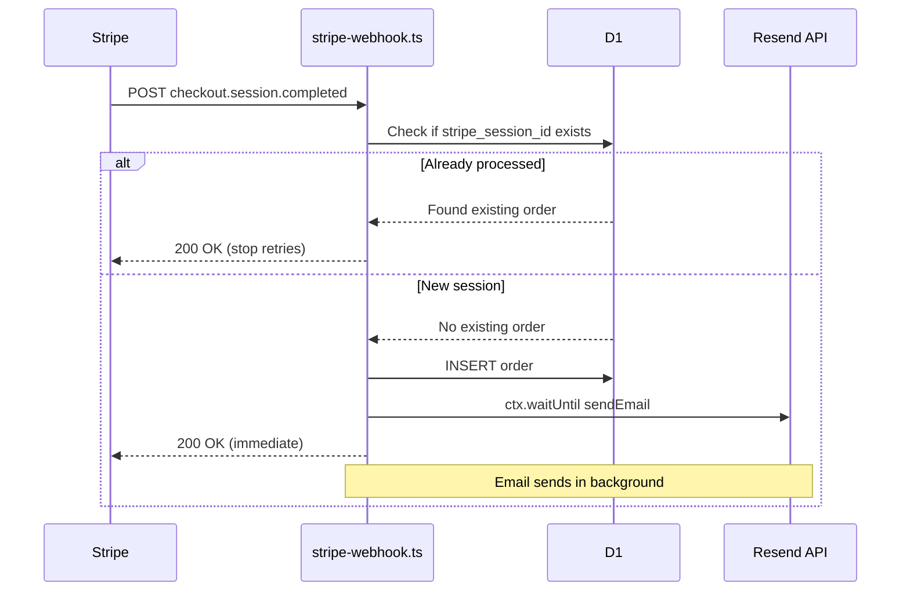

# Cloudflare Workers Request Limit — Edge Case Mitigation Plan

## Overview

This plan addresses the risk of hitting Cloudflare Pages Functions request limits (100k/day on free plan) due to Stripe webhook retry storms, bot activity, and traffic spikes. The changes focus on the four priorities identified in the architecture review.

---

## Priority 1: Fix Stripe Webhook Retry Storm (HIGH)

### Problem

In [`functions/api/books/stripe-webhook.ts`](../functions/api/books/stripe-webhook.ts), the `sendEmail()` call on line 130 is `await`ed **before** returning the 200 response to Stripe. The Resend API call takes 500ms-2000ms. On the free plan's 10ms CPU limit, this can cause the function to time out, resulting in:

1. Stripe receives no response or a 500 error
2. Stripe retries the webhook for up to 3 days with exponential backoff
3. Each retry hits the `UNIQUE` constraint on `stripe_session_id` and fails with 500
4. Hundreds of wasted requests per failed payment

### Solution

Two changes to [`functions/api/books/stripe-webhook.ts`](../functions/api/books/stripe-webhook.ts):

**Change A — Add idempotency check before insert (line ~105)**

```typescript
// Before inserting the order, check if we've already processed this session
const existingOrder = await env.DB.prepare(
  'SELECT id FROM orders WHERE stripe_session_id = ?'
).bind(sessionId).first();

if (existingOrder) {
  // Already processed — return 200 to stop Stripe retries
  return new Response(JSON.stringify({ success: true, received: true }), {
    status: 200,
    headers: { 'Content-Type': 'application/json' },
  });
}
```

**Change B — Move email send to `ctx.waitUntil()` (line ~130)**

Replace:
```typescript
await sendEmail(env.RESEND_API_KEY, { ... }, 'mailing');
```

With:
```typescript
// Send email in background — don't block the webhook response
ctx.waitUntil(sendEmail(env.RESEND_API_KEY, {
  to: customerEmail,
  subject: `Your Download — ${book.title}`,
  html: buildDownloadEmailHtml(book.title, downloadUrl, customerName),
  text: buildDownloadEmailText(book.title, downloadUrl, customerName),
}, 'mailing'));
```

**Note:** The `context` parameter is already available as the first argument to `onRequest`. The destructuring on line 24 is `{ request, env }` — we need to add `ctx` to the destructuring: `{ request, env, ctx }`.

### Data Flow After Fix



---

## Priority 2: Add Rate Limiting to Download Endpoint (MEDIUM)

### Problem

[`functions/api/books/download.ts`](../functions/api/books/download.ts) performs a D1 lookup on every request with no IP-based throttling. A bot cycling through random UUID download tokens could burn through the 100k/day request budget in minutes.

### Solution

Add IP-based rate limiting using D1 + `ctx.waitUntil()` to track attempts without blocking the response path. Create a new migration for a `download_attempts` table, and add rate limit logic to the download handler.

**New Migration — `migrations/0003_create_download_attempts.sql`**

```sql
-- Migration 0003: Track download attempt rates for rate limiting
CREATE TABLE IF NOT EXISTS download_attempts (
    id INTEGER PRIMARY KEY AUTOINCREMENT,
    ip_address TEXT NOT NULL,
    attempted_at TEXT NOT NULL DEFAULT (datetime('now'))
);

-- Index for efficient time-range queries
CREATE INDEX IF NOT EXISTS idx_download_attempts_ip_time
    ON download_attempts(ip_address, attempted_at);
```

**Changes to [`functions/api/books/download.ts`](../functions/api/books/download.ts)**

Add rate limit check after token validation (before the D1 lookup):

```typescript
// Rate limiting — check recent attempts from this IP
const ip = request.headers.get('CF-Connecting-IP') || 'unknown';

// Log this attempt in background (don't block the response)
ctx.waitUntil(env.DB.prepare(
  'INSERT INTO download_attempts (ip_address) VALUES (?)'
).bind(ip).run());

// Check if this IP has exceeded the rate limit (more than 10 attempts in the last minute)
const recentAttempts = await env.DB.prepare(
  `SELECT COUNT(*) as count FROM download_attempts
   WHERE ip_address = ? AND attempted_at > datetime('now', '-1 minute')`
).bind(ip).first<{ count: number }>();

if (recentAttempts && recentAttempts.count > 10) {
  return new Response(
    JSON.stringify({ success: false, message: 'Too many download attempts. Please try again later.' }),
    { status: 429, headers: { 'Content-Type': 'application/json', 'Retry-After': '60' } }
  );
}
```

**Note:** The `context` parameter needs `ctx` added to destructuring: `{ request, env, ctx }`.

### Rate Limit Configuration

| Limit | Window | Effect |
|-------|--------|--------|
| 10 attempts | 1 minute | Blocks brute-force bots |
| Resets automatically | Per rolling minute | No manual intervention needed |

---

## Priority 3: Add Observability to Wrangler Config (MEDIUM)

### Problem

There is no observability configuration in [`wrangler.jsonc`](../wrangler.jsonc). Without it, you cannot monitor request counts, error rates, or CPU usage — making it impossible to proactively detect when you're approaching the 100k/day limit.

### Solution

Add the `observability` block to [`wrangler.jsonc`](../wrangler.jsonc):

```jsonc
{
  "name": "lm-live-site",
  "pages_build_output_dir": ".",
  "observability": {
    "enabled": true,
    "head_sampling_rate": 1
  },
  // ... existing d1_databases, r2_buckets, env
}
```

This enables:
- **Request counts** — see exactly how many requests each endpoint is consuming
- **Error rates** — detect webhook failures immediately
- **CPU time** — identify functions approaching the 10ms/50ms limit
- **Logs** — structured JSON logging available in Cloudflare dashboard

**Also update `wrangler.toml`** with the equivalent:

```toml
[observability]
enabled = true
head_sampling_rate = 1
```

---

## Priority 4: Add Graceful Degradation to Frontend (LOW)

### Problem

When the 100k/day limit is hit, Cloudflare returns `530` or `1027` errors. The frontend currently has no handling for these responses — users would see a raw error instead of a friendly message.

### Solution

Update the API service layer in [`src/services/api.js`](../src/services/api.js) to detect rate-limit responses and show a user-friendly message.

**Changes to [`src/services/api.js`](../src/services/api.js)**

Add a response interceptor that checks for 429 (rate limit), 530 (over limit), and 1027 (over limit) responses:

```javascript
// Add to the fetch wrapper or response handling
if (response.status === 429 || response.status === 530) {
  // Rate limited or over daily request budget
  throw new ApiError(
    'We are experiencing high traffic. Please try again in a few minutes.',
    response.status
  );
}
```

**Changes to [`index.html`](../index.html)**

Update the `purchaseBook()` function and any other API-calling functions to catch rate-limit errors and display a friendly toast/modal:

```javascript
// In the catch block of API calls
catch (err) {
  if (err.status === 429 || err.status === 530) {
    showToast('We are experiencing high traffic. Please try again shortly.', 'warning');
  } else {
    showToast('Something went wrong. Please try again.', 'error');
  }
}
```

---

## Implementation Order

| Step | Task | Files | Dependencies |
|------|------|-------|-------------|
| 1 | Add idempotency check to webhook | [`stripe-webhook.ts`](../functions/api/books/stripe-webhook.ts) | None |
| 2 | Move email to `ctx.waitUntil()` | [`stripe-webhook.ts`](../functions/api/books/stripe-webhook.ts) | Step 1 |
| 3 | Create migration for download_attempts table | [`migrations/0003_create_download_attempts.sql`](../migrations/0003_create_download_attempts.sql) | None |
| 4 | Apply migration to D1 databases | Terminal: `wrangler d1 execute` | Step 3 |
| 5 | Add rate limiting to download endpoint | [`download.ts`](../functions/api/books/download.ts) | Steps 3, 4 |
| 6 | Add observability to wrangler config | [`wrangler.jsonc`](../wrangler.jsonc), [`wrangler.toml`](../wrangler.toml) | None |
| 7 | Add graceful degradation to frontend | [`api.js`](../src/services/api.js), [`index.html`](../index.html) | None |
| 8 | End-to-end testing | All | Steps 1-7 |

---

## Testing Checklist

- [ ] Webhook returns 200 on duplicate `stripe_session_id` (simulate Stripe retry)
- [ ] Email still sends when webhook succeeds (verify in Resend dashboard)
- [ ] Download endpoint returns 429 after 10+ rapid requests from same IP
- [ ] Download endpoint still works normally under normal usage
- [ ] Observability data visible in Cloudflare dashboard
- [ ] Frontend shows friendly message when API returns 429/530
- [ ] Existing purchase flow still works end-to-end
