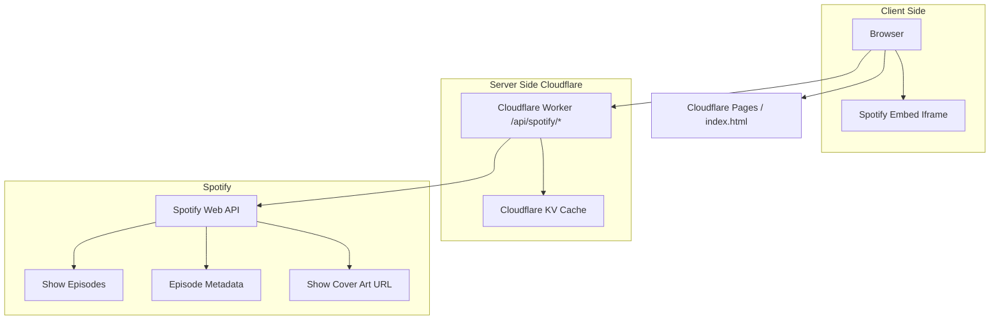
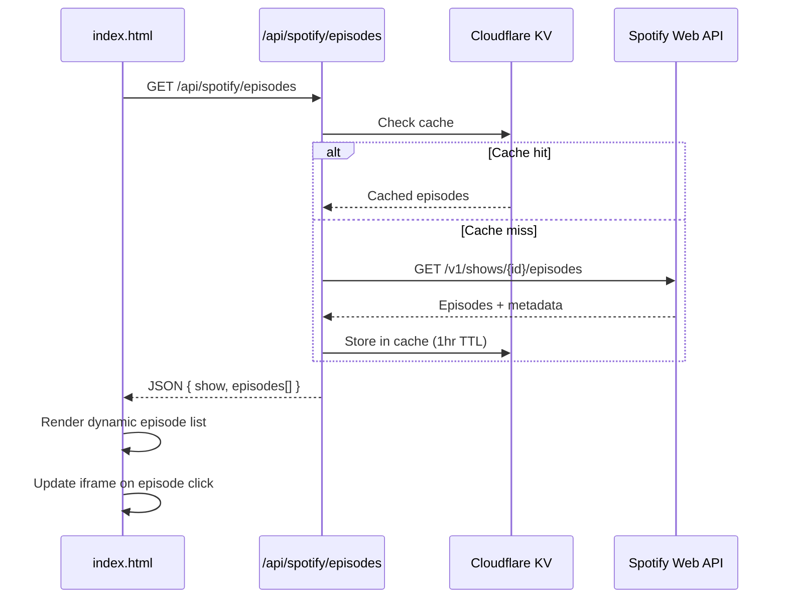

# Spotify "Freedom Sermons" Integration Plan

## 1. Current State Assessment

The site already has a **hybrid iframe-based** Spotify integration in the [`#broadcasts`](index.html:704) section:

- **Right panel**: A Spotify show embed iframe (`show/0KdGx6bE5KpdAskhmyBy04`) that displays the full "Freedom Sermons" show library
- **Left panel**: Three hardcoded sermon items with `data-spotify-episode` attributes that, when clicked, update the iframe `src` to point to a specific episode embed
- **Category filter buttons**: Client-side JS filtering by `data-series` attribute
- **Reset button**: Restores the iframe to the full show view

**Limitations of current approach:**
- Episode list is hardcoded — requires manual HTML updates for new episodes
- No track metadata displayed (title, duration, cover art) without clicking
- No "currently playing" indicator synced with actual playback
- No server-side token management
- Episode IDs are static and may become stale

---

## 2. Architecture Decision: Hybrid Approach

**Recommendation: Hybrid (Embed + Web API for metadata)**

| Approach | Pros | Cons |
|---|---|---|
| **Iframe embed only** (current) | Zero auth needed, Spotify handles playback UI, works on all devices | No control over UI, no track metadata, hardcoded episode list |
| **Spotify Web API only** | Full control over UI, dynamic episode list, rich metadata | Requires OAuth, rate limits, no built-in audio playback |
| **Hybrid** (recommended) | Best of both: iframe for playback, Web API for metadata + dynamic list | Two integration points, slightly more code |

**Decision**: Keep the iframe embed for actual audio playback (Spotify handles licensing, auth, and streaming), but add a **Cloudflare Workers proxy** that uses the **Spotify Web API** to dynamically fetch the show's episode list, cover art, and metadata. This gives us a dynamic, auto-updating episode list with rich metadata while keeping playback inside Spotify's embed.

---

## 3. System Architecture



---

## 4. Spotify API Setup

### 4.1 Create a Spotify App

1. Go to [https://developer.spotify.com/dashboard](https://developer.spotify.com/dashboard)
2. Create a new app (e.g., "LM Ministries Freedom Sermons")
3. Note the **Client ID** and **Client Secret**
4. No redirect URI needed (we use Client Credentials flow — server-side only)

### 4.2 API Credentials

Store as Cloudflare Worker secrets:

```
SPOTIFY_CLIENT_ID=your_client_id
SPOTIFY_CLIENT_SECRET=your_client_secret
```

### 4.3 Key Spotify IDs

- **Show ID**: `0KdGx6bE5KpdAskhmyBy04` (already in use)
- This is the "Freedom Sermons" podcast show

---

## 5. Cloudflare Worker: Spotify API Proxy

Create a new worker at [`functions/api/spotify/episodes.ts`](functions/api/spotify/episodes.ts) that:

### 5.1 Authentication (Client Credentials Flow)

```typescript
// functions/api/spotify/_token.ts
interface TokenCache {
  access_token: string;
  expires_at: number;
}

async function getAccessToken(env: Env): Promise<string> {
  // Check KV cache first
  const cached = await env.SPOTIFY_CACHE.get('spotify_token', 'json') as TokenCache | null;
  if (cached && cached.expires_at > Date.now()) {
    return cached.access_token;
  }

  // Fetch new token
  const resp = await fetch('https://accounts.spotify.com/api/token', {
    method: 'POST',
    headers: {
      'Content-Type': 'application/x-www-form-urlencoded',
      'Authorization': 'Basic ' + btoa(`${env.SPOTIFY_CLIENT_ID}:${env.SPOTIFY_CLIENT_SECRET}`)
    },
    body: 'grant_type=client_credentials'
  });

  const data = await resp.json();
  const token: TokenCache = {
    access_token: data.access_token,
    expires_at: Date.now() + (data.expires_in * 1000) - 60000 // 1min buffer
  };

  // Cache in KV
  await env.SPOTIFY_CACHE.put('spotify_token', JSON.stringify(token), {
    expirationTtl: data.expires_in - 60
  });

  return token.access_token;
}
```

### 5.2 Episodes Endpoint

```typescript
// functions/api/spotify/episodes.ts
interface Env {
  SPOTIFY_CLIENT_ID: string;
  SPOTIFY_CLIENT_SECRET: string;
  SPOTIFY_CACHE: KVNamespace;
}

export async function onRequest(context: EventContext<Env, any, any>) {
  const { env } = context;
  const SHOW_ID = '0KdGx6bE5KpdAskhmyBy04';
  
  try {
    const token = await getAccessToken(env);
    
    // Try KV cache for episodes list
    const cachedEpisodes = await env.SPOTIFY_CACHE.get('episodes_list', 'json');
    if (cachedEpisodes) {
      return new Response(JSON.stringify(cachedEpisodes), {
        headers: { 'Content-Type': 'application/json', 'Cache-Control': 'public, max-age=3600' }
      });
    }

    // Fetch show + episodes from Spotify API
    const [showResp, episodesResp] = await Promise.all([
      fetch(`https://api.spotify.com/v1/shows/${SHOW_ID}?market=US`, {
        headers: { 'Authorization': `Bearer ${token}` }
      }),
      fetch(`https://api.spotify.com/v1/shows/${SHOW_ID}/episodes?market=US&limit=20`, {
        headers: { 'Authorization': `Bearer ${token}` }
      })
    ]);

    const show = await showResp.json();
    const episodes = await episodesResp.json();

    const response = {
      show: {
        name: show.name,
        description: show.description,
        cover_url: show.images?.[0]?.url,
        publisher: show.publisher,
        total_episodes: show.total_episodes
      },
      episodes: episodes.items?.map((ep: any) => ({
        id: ep.id,
        name: ep.name,
        description: ep.description,
        duration_ms: ep.duration_ms,
        release_date: ep.release_date,
        cover_url: ep.images?.[0]?.url,
        audio_preview_url: ep.audio_preview_url,
        external_url: ep.external_urls?.spotify
      })) || []
    };

    // Cache only the first page (offset=0) in KV for 1 hour.
    // Paginated requests (offset > 0) skip KV and hit Spotify API directly.
    // This keeps KV storage minimal while still caching the most-requested data.
    if (offset === 0) {
      await env.SPOTIFY_CACHE.put('episodes_list', JSON.stringify(response), {
        expirationTtl: 3600
      });
    }

    return new Response(JSON.stringify(response), {
      headers: { 'Content-Type': 'application/json', 'Cache-Control': 'public, max-age=3600' }
    });
  } catch (err) {
    return new Response(JSON.stringify({ error: 'Failed to fetch episodes' }), {
      status: 500,
      headers: { 'Content-Type': 'application/json' }
    });
  }
}
```

### 5.3 Wrangler Configuration

Add to [`wrangler.jsonc`](wrangler.jsonc):

```jsonc
{
  // ... existing config
  "kv_namespaces": [
    {
      "binding": "SPOTIFY_CACHE",
      "id": "your-kv-namespace-id"
    }
  ],
  "vars": {
    "SPOTIFY_CLIENT_ID": "",
    "SPOTIFY_CLIENT_SECRET": ""
  }
}
```

Create the KV namespace:
```bash
npx wrangler kv:namespace create "SPOTIFY_CACHE"
```

Set secrets:
```bash
npx wrangler secret put SPOTIFY_CLIENT_ID
npx wrangler secret put SPOTIFY_CLIENT_SECRET
```

---

## 6. Frontend Implementation

### 6.1 Data Flow



### 6.2 Updated HTML Structure

Replace the hardcoded sermon list with a dynamically rendered one:

```html
<!-- Left: Dynamically loaded episode list -->
<div class="lg:col-span-7 space-y-4" id="sermonsContainer">
  <!-- Loading skeleton -->
  <div id="sermonsLoading" class="space-y-4">
    <div class="bg-lm-slate/60 rounded-2xl p-5 animate-pulse h-24"></div>
    <div class="bg-lm-slate/60 rounded-2xl p-5 animate-pulse h-24"></div>
    <div class="bg-lm-slate/60 rounded-2xl p-5 animate-pulse h-24"></div>
  </div>
  <!-- Episodes injected here by JS -->
  <div id="sermonsList" class="space-y-4 hidden"></div>
  <!-- Error / empty state -->
  <div id="sermonsError" class="hidden text-center py-12">
    <p class="text-lm-silver text-sm">Unable to load episodes. 
      <a href="https://open.spotify.com/show/0KdGx6bE5KpdAskhmyBy04" 
         target="_blank" 
         class="text-lm-blue hover:underline">
        Listen on Spotify <i class="fa-solid fa-external-link-alt text-xs"></i>
      </a>
    </p>
  </div>
</div>
```

### 6.3 JavaScript: Fetch and Render Episodes

```javascript
// ===== SPOTIFY EPISODE LOADER =====
const SPOTIFY_SHOW_ID = '0KdGx6bE5KpdAskhmyBy04';

async function loadSpotifyEpisodes() {
  const loadingEl = document.getElementById('sermonsLoading');
  const listEl = document.getElementById('sermonsList');
  const errorEl = document.getElementById('sermonsError');

  try {
    const resp = await fetch('/api/spotify/episodes');
    if (!resp.ok) throw new Error('Failed to fetch');
    const data = await resp.json();

    loadingEl.classList.add('hidden');
    listEl.classList.remove('hidden');
    listEl.innerHTML = '';

    data.episodes.forEach((ep, index) => {
      const duration = formatDuration(ep.duration_ms);
      const date = new Date(ep.release_date).toLocaleDateString('en-US', {
        month: 'short', day: 'numeric', year: 'numeric'
      });

      const item = document.createElement('div');
      item.className = 'sermon-item bg-lm-slate/60 hover:bg-lm-slate border border-white/5 rounded-2xl p-5 flex items-center justify-between gap-4 transition-all duration-300 cursor-pointer';
      item.id = `item-sermon-${ep.id}`;
      item.dataset.spotifyEpisode = ep.id;
      item.onclick = () => loadSpotifySermon(ep.id, item.id);

      item.innerHTML = `
        <div class="flex items-center gap-4 min-w-0 flex-1">
          
          <div class="min-w-0">
            <span class="text-[10px] text-lm-blue uppercase font-bold tracking-wider">${date}</span>
            <h3 class="font-serif text-lg font-medium text-white dark:text-white light:text-gray-900 mt-0.5 truncate">${ep.name}</h3>
            <p class="text-xs text-lm-silver mt-1 truncate">${truncateText(stripHtml(ep.description || ''), 120)}</p>
          </div>
        </div>
        <span class="text-xs text-lm-silver hidden sm:block flex-shrink-0">${duration}</span>
      `;

      listEl.appendChild(item);
    });

    // Update show metadata
    updateShowMetadata(data.show);

  } catch (err) {
    console.error('Failed to load Spotify episodes:', err);
    loadingEl.classList.add('hidden');
    errorEl.classList.remove('hidden');
  }
}

function formatDuration(ms) {
  const minutes = Math.floor(ms / 60000);
  const hours = Math.floor(minutes / 60);
  const mins = minutes % 60;
  return hours > 0 ? `${hours}:${String(mins).padStart(2, '0')}` : `${mins}:${String(Math.round((ms % 60000) / 1000)).padStart(2, '0')}`;
}

function stripHtml(html) {
  const div = document.createElement('div');
  div.innerHTML = html;
  return div.textContent || div.innerText || '';
}

function truncateText(text, maxLen = 120) {
  if (text.length <= maxLen) return text;
  return text.substring(0, maxLen).replace(/\s+\S*$/, '') + '...';
}

function updateShowMetadata(show) {
  // Update the right panel header with show info
  const headerEl = document.querySelector('#spotifyEmbedContainer + .flex .flex-col h4');
  if (headerEl && show.name) {
    headerEl.textContent = show.name;
  }
  // Could also update cover art, description, etc.
}
```

### 6.4 Search / Sort (Replacing Category Filters)

Remove the category filter buttons entirely. Replace with a simple search input and sort toggle:

```html
<div class="flex flex-col sm:flex-row items-start sm:items-center justify-between gap-3 mb-6">
  <div class="relative flex-1 max-w-xs">
    <i class="fa-solid fa-search absolute left-3 top-1/2 -translate-y-1/2 text-lm-silver text-xs"></i>
    <input type="text" id="sermonSearch" placeholder="Search episodes..."
           class="w-full bg-lm-deep/60 border border-white/10 rounded-full py-2.5 pl-9 pr-4 text-xs text-white placeholder-lm-silver focus:outline-none focus:border-lm-blue transition-all">
  </div>
  <button id="sortToggle" onclick="toggleSort()"
          class="text-xs text-lm-silver hover:text-white transition-colors flex items-center gap-1.5">
    <i class="fa-solid fa-arrow-up-wide-short"></i>
    <span id="sortLabel">Newest First</span>
  </button>
</div>
```

The search filters client-side by episode title/description. Sort toggles between newest-first (default from API) and oldest-first.

### 6.5 "Load More" Pagination

The Worker endpoint accepts an `offset` query parameter to paginate through Spotify's API:

```typescript
// In functions/api/spotify/episodes.ts
const url = new URL(context.request.url);
const limit = Math.min(parseInt(url.searchParams.get('limit') || '10'), 50);
const offset = parseInt(url.searchParams.get('offset') || '0');

const episodesResp = await fetch(
  `https://api.spotify.com/v1/shows/${SHOW_ID}/episodes?market=US&limit=${limit}&offset=${offset}`,
  { headers: { 'Authorization': `Bearer ${token}` } }
);
```

Frontend "Load More" button:

```html
<div id="sermonsLoadMore" class="text-center mt-6 hidden">
  <button onclick="loadMoreEpisodes()"
          class="px-6 py-3 border border-white/10 hover:border-lm-blue text-white text-xs font-semibold rounded-full transition-all bg-white/5 hover:bg-lm-blue/10">
    <i class="fa-solid fa-plus mr-1.5"></i> Load More Episodes
  </button>
</div>
```

State management:

```javascript
let currentOffset = 0;
const PAGE_SIZE = 10;
let allEpisodes = [];
let isLoadingMore = false;

async function loadSpotifyEpisodes() {
  currentOffset = 0;
  // ... initial fetch with limit=PAGE_SIZE, offset=0
  // Show "Load More" if total_episodes > PAGE_SIZE
}

async function loadMoreEpisodes() {
  if (isLoadingMore) return;
  isLoadingMore = true;
  currentOffset += PAGE_SIZE;
  
  try {
    const resp = await fetch(`/api/spotify/episodes?limit=${PAGE_SIZE}&offset=${currentOffset}`);
    const data = await resp.json();
    
    if (data.episodes.length === 0) {
      document.getElementById('sermonsLoadMore').classList.add('hidden');
      return;
    }
    
    renderEpisodes(data.episodes);
    allEpisodes = allEpisodes.concat(data.episodes);
    
    if (currentOffset + PAGE_SIZE >= data.show.total_episodes) {
      document.getElementById('sermonsLoadMore').classList.add('hidden');
    }
  } catch (err) {
    console.error('Failed to load more episodes:', err);
  } finally {
    isLoadingMore = false;
  }
}
```

### 6.6 "Listen on Spotify" Button

Add a persistent call-to-action in the right panel header and below the episode list:

```html
<!-- In right panel header -->
<a href="https://open.spotify.com/show/0KdGx6bE5KpdAskhmyBy04"
   target="_blank"
   class="ml-auto px-3 py-1.5 rounded-full text-[11px] font-semibold bg-green-600/20 hover:bg-green-600/40 text-green-400 transition-all border border-green-500/20 flex items-center gap-1.5 flex-shrink-0">
  <i class="fa-brands fa-spotify text-xs"></i>
  <span class="hidden sm:inline">Spotify</span>
</a>

<!-- Below episode list -->
<div class="text-center mt-8">
  <a href="https://open.spotify.com/show/0KdGx6bE5KpdAskhmyBy04"
     target="_blank"
     class="inline-flex items-center gap-2 px-5 py-2.5 bg-green-600 hover:bg-green-700 text-white text-xs font-semibold rounded-full transition-all shadow-lg shadow-green-600/20">
    <i class="fa-brands fa-spotify text-sm"></i>
    Listen to Full Show on Spotify
  </a>
</div>
```

---

## 7. Styling for Dark Gradient + Wallpaper Aesthetic

### 7.1 Current Aesthetic Reference

- Background: `lm-deep` (#0B0D13) with `lm-slate/20` overlay
- Cards: `bg-lm-slate/60` with `border-white/5`
- Accents: `lm-blue` (#0F4C81), `lm-gold` (#D4AF37)
- Glass panels: `backdrop-filter: blur(20px)` with rgba overlays
- Wallpaper: `src/assets/LM-GlobalWallpaper.png` as hero background

### 7.2 Episode List Item Styling

The existing sermon items already match the aesthetic. Key additions:

```css
/* Episode cover art thumbnail in list items */
.sermon-item .episode-thumb {
  width: 48px;
  height: 48px;
  border-radius: 12px;
  object-fit: cover;
  border: 1px solid rgba(255,255,255,0.06);
}

/* Currently playing indicator */
.sermon-item.playing {
  border-color: #1DB954 !important; /* Spotify green */
  background: rgba(29, 185, 84, 0.08) !important;
}
.sermon-item.playing .play-icon {
  color: #1DB954;
}

/* Loading skeleton animation */
@keyframes shimmer {
  0% { background-position: -200px 0; }
  100% { background-position: calc(200px + 100%) 0; }
}
.skeleton-pulse {
  background: linear-gradient(90deg, rgba(255,255,255,0.03) 25%, rgba(255,255,255,0.06) 50%, rgba(255,255,255,0.03) 75%);
  background-size: 200px 100%;
  animation: shimmer 1.5s ease-in-out infinite;
}
```

### 7.3 Light Mode Overrides for New Elements

Add to the existing `<style>` block in [`index.html`](index.html):

```css
/* Light mode: search input */
.light #sermonSearch {
  background: rgba(255,255,255,0.8) !important;
  border-color: rgba(15,76,129,0.15) !important;
  color: #1e293b !important;
}
.light #sermonSearch::placeholder {
  color: #94a3b8 !important;
}

/* Light mode: sort toggle */
.light #sortToggle {
  color: #64748b !important;
}
.light #sortToggle:hover {
  color: #1e293b !important;
}

/* Light mode: Load More button */
.light #sermonsLoadMore button {
  background: rgba(255,255,255,0.7) !important;
  border-color: rgba(15,76,129,0.15) !important;
  color: #1e293b !important;
}
.light #sermonsLoadMore button:hover {
  background: rgba(15,76,129,0.08) !important;
  border-color: #0F4C81 !important;
}

/* Light mode: episode cover art border */
.light .sermon-item img[class*="rounded-xl"] {
  border-color: rgba(15,76,129,0.1) !important;
}

/* Light mode: "Listen on Spotify" CTA */
.light a[class*="bg-green-600"] {
  color: #ffffff !important;
}
```

### 7.4 Right Panel Enhancements

Add show cover art and metadata above the iframe. Use a gradient placeholder matching the lm-deep aesthetic:

```html
<div class="flex items-center gap-3 mb-4 border-b border-white/10 pb-4">
  
  <div class="flex flex-col min-w-0">
    <h4 class="text-xs uppercase font-bold tracking-widest text-white truncate">Freedom Sermons</h4>
    <span id="playerActiveLabel" class="text-[10px] text-lm-silver mt-0.5">Viewing Show Library</span>
  </div>
  <a href="https://open.spotify.com/show/0KdGx6bE5KpdAskhmyBy04" 
     target="_blank"
     class="ml-auto px-3 py-1.5 rounded-full text-[11px] font-semibold bg-green-600/20 hover:bg-green-600/40 text-green-400 transition-all border border-green-500/20 flex items-center gap-1.5 flex-shrink-0">
    <i class="fa-brands fa-spotify text-xs"></i>
    <span class="hidden sm:inline">Spotify</span>
  </a>
</div>
```

---

## 8. Responsive Behavior

| Breakpoint | Left Panel (episode list) | Right Panel (iframe) |
|---|---|---|
| `lg` (1024px+) | `lg:col-span-7` | `lg:col-span-5`, fixed `h-[520px]` |
| `md` (768px) | Full width | Full width below, `h-[400px]` |
| `sm` (640px) | Full width | Full width below, `h-[350px]` |
| Default | Full width | Full width below, `h-[300px]` |

The iframe embed is inherently responsive — it scales to container width. The height should use `min-height` with aspect-ratio fallback:

```css
#spotifyEmbedContainer {
  min-height: 300px;
}
@media (min-width: 1024px) {
  #spotifyEmbedContainer {
    min-height: 420px;
  }
}
```

---

## 9. Performance Considerations

| Concern | Mitigation |
|---|---|
| **Spotify API rate limits** | KV cache with 1-hour TTL; only 1 API call per hour |
| **Slow initial load** | Show skeleton loading state immediately |
| **Iframe load time** | `loading="lazy"` already set; consider `fetchpriority="low"` |
| **KV read latency** | KV reads are <5ms in production; negligible |
| **Token refresh** | Cached in KV with 50-minute TTL (tokens last 1 hour) |
| **Episode list staleness** | 1-hour cache is acceptable for a podcast show |

---

## 10. Error Handling & Fallbacks

| Scenario | Fallback |
|---|---|
| **Spotify API down** | Show error state with direct "Listen on Spotify" link |
| **KV unavailable** | Worker fetches fresh data from Spotify API |
| **Token fetch fails** | Return cached data if available, else show error |
| **No episodes returned** | Show empty state with "Check back soon" message |
| **Iframe fails to load** | Browser shows native iframe error; provide direct link |

---

## 11. Implementation Steps

### Phase 1: Server-Side (Cloudflare Worker)

1. Create KV namespace `SPOTIFY_CACHE` via wrangler CLI
2. Create [`functions/api/spotify/_token.ts`](functions/api/spotify/_token.ts) -- token management with KV caching
3. Create [`functions/api/spotify/episodes.ts`](functions/api/spotify/episodes.ts) -- episodes endpoint with `limit` and `offset` query params for pagination
4. Add `SPOTIFY_CLIENT_ID` and `SPOTIFY_CLIENT_SECRET` as wrangler secrets
5. Update [`wrangler.jsonc`](wrangler.jsonc) with KV binding

### Phase 2: Frontend

6. Update [`index.html`](index.html) -- replace hardcoded sermon list with dynamic container including:
   - Loading skeleton with 3 placeholder items
   - Dynamic episode list with cover art thumbnails 64x64
   - Search input with client-side filtering by title/description
   - Sort toggle newest/oldest
   - "Load More" button with pagination state
   - Error state with direct Spotify link fallback
7. Add `loadSpotifyEpisodes()` and `loadMoreEpisodes()` functions to the inline `<script>`
8. Update right panel header with show cover art and compact "Spotify" button
9. Add prominent "Listen to Full Show on Spotify" CTA below episode list
10. Remove category filter buttons and reset-to-show button
11. Add CSS for loading skeleton, playing state indicator, and episode thumbnails

### Phase 3: Polish

12. Test with real Spotify API credentials
13. Verify responsive behavior at all breakpoints
14. Add `fetchpriority` and performance optimizations
15. Test error states (API down, no episodes, pagination edge cases)

---

## 12. Files to Create / Modify

| File | Action | Purpose |
|---|---|---|
| [`functions/api/spotify/_token.ts`](functions/api/spotify/_token.ts) | **Create** | Spotify OAuth token management with KV caching |
| [`functions/api/spotify/episodes.ts`](functions/api/spotify/episodes.ts) | **Create** | Episodes API endpoint, fetches show + episode data |
| [`wrangler.jsonc`](wrangler.jsonc) | **Modify** | Add `kv_namespaces` binding for `SPOTIFY_CACHE` |
| [`index.html`](index.html) | **Modify** | Replace hardcoded sermon list, add dynamic rendering, update right panel |
| [`.dev.vars`](.dev.vars) | **Modify** | Add `SPOTIFY_CLIENT_ID` and `SPOTIFY_CLIENT_SECRET` for local dev |

---

## 13. Resolved Decisions

| Question | Decision |
|---|---|
| Category filtering | **Removed**. Replaced with search input + sort toggle newest/oldest. |
| Episode count | **10 per page** with "Load More" button. Paginate via Spotify API `offset` param. |
| Audio previews | **No**. Stick with iframe embed for playback. 30s clips don't reduce request counts meaningfully since we already cache the episode list in KV for 1 hour. |
| Cover art size | **64x64 thumbnails** in episode list items. Use Spotify's smallest image from the `images` array. |
| "Listen on Spotify" button | **Yes** -- in right panel header compact and below episode list as prominent CTA. |
| KV caching strategy | **Cache only first page (offset=0)** in KV. Paginated requests skip KV and hit Spotify API directly. |
| Search scope | **Search only within already-loaded episodes** client-side. No server-side search. |
| Light mode overrides | **Yes** -- add CSS overrides for search input, sort toggle, Load More button, episode thumbnails, and Spotify CTA. |
| Description truncation | **120 characters** client-side via `truncateText()` function, word-boundary aware with ellipsis. |
| Show cover placeholder | **SVG gradient placeholder** matching lm-deep aesthetic with "LM" text, replaced by API response. |
